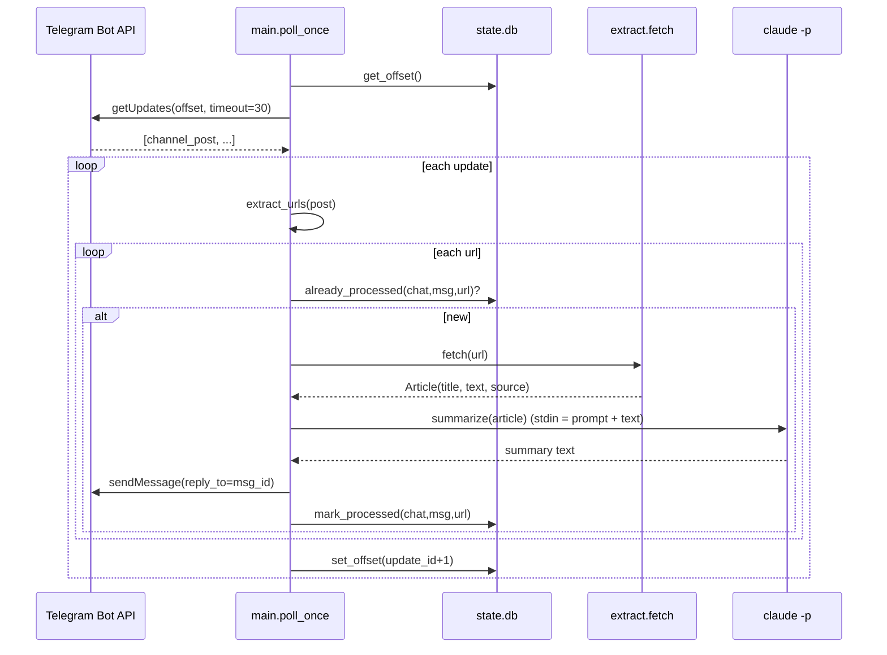

# Architecture

## Overview

Oracle is a single long-running Python process that turns links posted in a Telegram
channel into summary replies. It is deliberately small: no web server, no database server,
no message queue. State is a local SQLite file; summarization is delegated to the already
authenticated `claude` CLI.

```
Telegram channel ──(channel_post)──> Bot getUpdates(long-poll, offset)
        ▲                                      │
        │ sendMessage(reply_to=msg_id)         ▼
   summary text  <── claude -p  <── clean text  <── trafilatura (→ Jina fallback)
                                   (dedup + offset in SQLite state.db)
```

## Request flow (per poll cycle)



## Module responsibilities

| Module | Responsibility |
| --- | --- |
| `app/config.py` | Loads `.env` (own tiny parser, no dep) into `os.environ`; exposes typed settings; `require_token()` fails fast if `BOT_TOKEN` is missing. |
| `app/telegram.py` | Thin Bot API client (`get_updates`, `send_message`) and `extract_urls(message)`. Chunks long messages to ≤4096 chars (`_chunk`). |
| `app/extract.py` | `fetch(url) -> Article`. trafilatura first; falls back to `r.jina.ai` when the result is empty or `< MIN_CONTENT_CHARS`. Caps to `MAX_INPUT_CHARS`. Never raises — returns an empty `Article` on failure. |
| `app/summarize.py` | `summarize(article)` shells out to `claude -p --model <M> --max-turns 1`, feeding `prompt + text` on stdin. `format_reply` appends the source link. |
| `app/state.py` | SQLite wrapper: long-poll offset + dedup table. WAL mode. |
| `app/main.py` | The loop: long-poll, per-link `try/except`, exponential network backoff, logging. CLI flags `--once`, `--dry-run`. |

## State schema (`state.db`)

```sql
meta(key TEXT PRIMARY KEY, value TEXT)            -- key 'offset' = next getUpdates offset
processed(chat_id INTEGER, message_id INTEGER,    -- dedup: one row per summarized URL
          url TEXT, ts TEXT, PRIMARY KEY(chat_id, message_id, url))
```

## Key design decisions

- **Bot + long-poll, not a webhook.** A bot added as channel admin receives `channel_post`
  updates with no public endpoint, so there's nothing to expose to the internet and no TLS
  to manage. Trade-off: a few seconds of latency vs. instant webhook delivery.
- **`claude -p` CLI, not the Anthropic API.** The box already has an authenticated `claude`
  CLI, so summaries need no separate API key or billing setup. `--max-turns 1` keeps it from
  trying to use tools/browse — it just summarizes the text we hand it on stdin.
- **trafilatura → Jina fallback.** trafilatura is fast, local, and excellent at boilerplate
  removal for static HTML. JS-heavy or paywalled pages return little, so we fall back to the
  `r.jina.ai` reader (server-side render → clean markdown) only when needed.
- **SQLite for state.** Single-process, durable, zero-ops. Both the poll offset and dedup
  live in one file that's trivial to back up.
- **Plain-text replies.** Avoids Telegram Markdown/HTML escaping failures on arbitrary
  summary text; link previews are disabled to reduce noise.

## Extension points

- **New content source / extractor.** Add a `_via_x(url) -> Article` in `app/extract.py`
  and slot it into `fetch()`'s fallback chain (e.g. `youtube-transcript-api` for YouTube,
  `pypdf` for PDFs). Keep the "never raise; return empty Article" contract.
- **Swap the summarizer.** Replace the body of `summarize()` in `app/summarize.py` (e.g. to
  call the Anthropic API) — the rest of the pipeline only depends on its `str` return.
- **Change the summary format.** Edit the `_PROMPT` template in `app/summarize.py`.
- **Multiple channels.** `ALLOWED_CHAT_IDS` already accepts a comma-separated list.

## Failure modes & resilience

- **One bad link** is caught per-URL in `main.process_post`; it's logged and the loop
  continues. The offset still advances so a single poisonous post can't wedge the queue.
- **Network errors** in the poll loop trigger exponential backoff (1→60s) in `run_forever`.
- **Extractor failures** return an empty `Article`; the URL is skipped (not marked processed,
  so a later code/network fix can retry it on the next post — note offset has advanced, so
  retry happens only for *new* posts unless state is reset).
- **Dedup** keys on `(chat_id, message_id, url)`, so restarts and retries never double-post.
- **`--dry-run` caveat:** `poll_once` advances the offset even in dry-run (it does not call
  `mark_processed`). To replay a post after a dry-run, reset the offset:
  `python -c "from app.state import State; s=State(); s.set_offset(0)"`.
